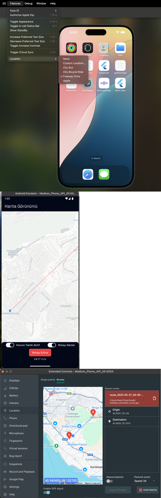

# 🛵 Martı Case Study — Arka Plan Konum Takip Uygulaması

Bu proje, **Martı Technologies** için hazırlanmış bir case çalışmasıdır. Uygulama, kullanıcının konumunu gerçek zamanlı izler, her 100 metrede bir haritaya işaret (marker) bırakır ve bu verileri arka planda da takip edebilir. Rota, uygulama kapatılsa bile korunur ve isteğe bağlı olarak sıfırlanabilir.

---

## 🚀 Başlarken

### Gereksinimler

- Flutter SDK
- Android Studio veya Xcode
- Gerçek cihaz veya emülatör

---

## ✨ Özellikler

- Gerçek zamanlı konum takibi
- Her 100 metrede bir marker bırakma
- Rota çizgisi (polyline) gösterimi (aç/kapat özelliğiyle)
- Arka planda takip desteği
- Rota sıfırlama seçeneği
- Uygulama tekrar açıldığında rotayı koruma
- Marker'a tıklanınca adres gösterme (opsiyonel)
- GPX/KML ile rota simülasyonu desteği

---

## 🧪 Simülasyon Kılavuzu

### ✅ iOS Simülatörü

- Xcode üzerinden uygulamayı çalıştırın.
- Menüden `Debug > Location` seçin.
- `Freeway Drive` (araç simülasyonu), `City Run` vb. seçeneklerden biriyle simülasyon başlatın.

> 📌 iOS için GPX dosyasına gerek yoktur.

---

### ✅ Android Emülatörü

1. Android Studio'da emülatörü açın.
2. `Extended Controls > Location > GPX` sekmesine gidin.
3. Aşağıdaki örnek dosyalardan birini seçin:

gpx_assets/
├── maltepe_extended_route.gpx
└── rome_simulation_route.gpx

4. `Play` tuşuna basarak simülasyonu başlatın.

### ⚠️ Neden Hareket Durumu Zorlanıyor?

> **Android emülatörü**, GPX dosyasından konumu güncelleyebilir ancak hareket halinde olduğunu anlayamaz.  
> Bu nedenle uygulama, GPX kullandığınızı belirttiğinizde `background_geolocation` paketini manuel olarak "hareket halinde" duruma geçirir. Aksi halde konum güncellemeleri alınmaz.
---

## 🖼️ Simülasyon Görselleri

Aşağıda iOS ve Android simülasyon ortamlarında uygulamanın çalışma anları yer almaktadır:


---

### ✅ Gerçek Cihazlar

Gerçek cihazlarda sahte GPS ile rota simülasyonu yapmak için aşağıdaki uygulamaları kullanabilirsiniz:

- [GPS Emulator](https://play.google.com/store/apps/details?id=com.rosteam.gpsemulator)
- [Fake GPS Location - Lexa](https://play.google.com/store/apps/details?id=com.lexa.fakegps)
- [Mock Locations](https://play.google.com/store/apps/details?id=ru.gavrikov.mocklocations)

1. Geliştirici seçeneklerini açın
2. "Sahte konum uygulaması" olarak yukarıdakilerden birini seçin
3. Simülasyon rotanızı oluşturup çalıştırın

---

## 📁 Proje Yapısı (Kontrol için gerekli temel dosyalar)

```bash
lib/
├── main.dart
├── marti_app.dart
├── views/
│   └── home_view/
│        ├── home_view.dart
│        └── home_viewmodel.dart
│        └── _partials (Widgets)
├── viewmodel/
│   └── home_viewmodel.dart
assets/
└── gpx_assets/
    ├── maltepe_extended_route.gpx
    └── rome_simulation_route.gpx

👤 Hazırlayan

[Veli Kaan Çetinel]
Bu proje, Martı Technologies başvuru süreci kapsamında hazırlanmıştır.